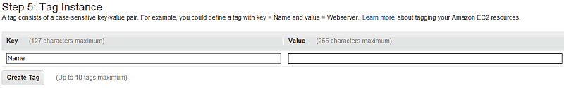

# testing-complex-task-markdown

1.  Here's the first step of a complex task.

    Here's (something in parens) in the info element following the first step.

    `# /opt/blah/client/version/dsa/barnc-init`

    where *version* is the version of DSU you are configuring.

    A prompt displays.

2.  A step with an image inline of a scr-schot.

    

3.  From your SSH client console, Lorem ipsum dolor sit amet, consectetuer adipiscing elit, sed diam nonummy nibh euismod tincidunt ut laoreet dolore magna aliquam erat volutpat `ec2-user`.

    ```
    # ssh -i  private-key-file  blah@public-DNS  or  public-IP
    					
    ```

    where:

    -    *private-key-file* is the private key file (`.pem`) of the Lorem ipsum dolor sit amet, consectetuer adipiscing elit, sed diam nonummy nibh euismod tincidunt ut laoreet dolore magna aliquam erat volutpat.
    -    *public-DNS* is the public DNS name or *public-IP* is the Lorem ipsum dolor sit amet, consectetuer adipiscing elit, sed diam nonummy nibh euismod tincidunt ut laoreet dolore magna aliquam erat volutpat.
4.  From your Lorem ipsum dolor sit amet, consectetuer adipiscing elit, sed diam nonummy nibh euismod tincidunt ut laoreet dolore magna aliquam erat volutpat, log on to the DSU instance as `ec2-user` using Lorem ipsum dolor sit amet, consectetuer adipiscing elit, sed diam nonummy nibh euismod tincidunt ut laoreet dolore magna aliquam erat volutpat.

    ```
    # ssh -i  private-key-file  ec2-user@public-DNS  or  public-IP
    					
    ```

    where:

    -    *private-key-file* is the private key file (`.pem`) of the Lorem ipsum dolor sit amet, consectetuer adipiscing elit, sed diam nonummy nibh euismod tincidunt ut laoreet dolore magna aliquam erat volutpat.
    -    *public-DNS* is the public DNS name or *public-IP* is the Lorem ipsum dolor sit amet, consectetuer adipiscing elit, sed diam nonummy nibh euismod tincidunt ut laoreet dolore magna aliquam erat volutpat.
5.  Enter the name of the server.

    For example, `prodApp-1`.

    The script appends **_media** to the name. Another prompt displays.

6.  Enter the IP address for the server running Lorem ipsum dolor sit amet, consectetuer adipiscing elit, sed diam nonummy nibh euismod tincidunt ut laoreet dolore magna aliquam erat volutpat.

    This IP address is the same as the DSC server that is running. For example, `9.8.7.6`.

    The script verifies the connection to this IP address on ports 61616 and 15401. If successful, Lorem ipsum dolor sit amet, consectetuer adipiscing elit, sed diam nonummy nibh euismod tincidunt ut laoreet dolore magna aliquam erat volutpat.

7.  If the connection to the IP address fails, run the script again and provide the correct IP address to configure and initialize Lorem ipsum dolor sit amet, consectetuer adipiscing elit, sed diam nonummy nibh euismod tincidunt ut laoreet dolore magna aliquam erat volutpat.
8.  Enter the host name of the Lorem ipsum dolor sit amet, consectetuer adipiscing elit, sed diam nonummy nibh euismod tincidunt ut laoreet dolore magna aliquam erat volutpat.

    This host name is the DNS name for the first lorem ipsum node. For example, `ip-1-2-3-4`.

9.  Here's step two of this complex task.

Using this info element to put in a table.

  |Header row, cell 0-1|Header row, cell 1-1|
  |--------------------|--------------------|
  |Table row, cell 0-2<br/>​paragraph in a table row, cell 0-2<br/><ul><li>​unordered list item 1 in table row, cell 0-2</li></ul>|Table row, cell 1-2<br/>​paragraph in a table row, cell 1-2<br/><ol><li>​ordered list item 1 in a table row, cell 1-2</li></ol>|
  |<span class="monospace CodeMirror">filepath</span> in a table row, cell 0-3|<b>cmdname</b> in a table row, cell 1-3|
  |<span class="monospace CodeMirror">userinput</span> in a table row, cell 0-4|<i>cite</i> in a table row, cell 1-4|
  |<b>uicontrol</b> in a table row, cell 0-5|<b>uicontrol</b> in a table row, cell 1-5|
  |Try a codeblock in this table row.<br/>```​    <xsl:call-template name="process-inline-contents"/>   <xsl:call-template name="process-inline-contents"/>```<br/><br/>|Try a codeph in this table row.<span class="monospace CodeMirror">a little codeph</span>|

10. This step is followed by a stepresult.

    The stepresult following a cmd

11. Here's a `filepath` in a step, followed by a **cmdname** in a step, followed by `userinput` in a step, **uicontrol** in a step, ending with a *cite* in a step.

    This info directly follows the cmd in a step.

12. Using this step for a dl.

    Between steps 4 and 6 with a definition list

    <dl><dt>definition term 1</dt><dd>​definition description 1</dd></dl>
    <dl><dt>definition term 2</dt><dd>​definition description 2</dd></dl>
13. We'll try a choicetable in this step

  |Choicetable header row, cell 0-1|Choicetable header row, cell 1-1|
  |--------------------------------|--------------------------------|
  |Table row, cell 0-2<br/>​paragraph in a table row, cell 0-2<br/><ul><li>​unordered list item 1 in table row, cell 0-2</li></ul>|Table row, cell 1-2<br/>​paragraph in a table row, cell 1-2<br/><ol><li>​ordered list item 1 in a table row, cell 1-2</li></ol>|
  |<span class="monospace CodeMirror">filepath</span> in a table row, cell 0-3|<b>cmdname</b> in a table row, cell 1-3|
  |<span class="monospace CodeMirror">userinput</span> in a table row, cell 0-4|<i>cite</i> in a table row, cell 1-4|
  |<b>uicontrol</b> in a table row, cell 0-5|<b>uicontrol</b> in a table row, cell 1-5|
  |Try a codeblock in this table row.<br/>```​    <xsl:call-template name="process-inline-contents"/>   <xsl:call-template name="process-inline-contents"/>```<br/><br/>|Try a codeph in this table row.<span class="monospace CodeMirror">a little codeph</span><ol><li>​ordered list with a codeblock    <br/><span class="monospace CodeMirror">​    <xsl:call-template name="process-inline-contents"/>   <xsl:call-template name="process-inline-contents"/></span><br/></li><li>​ordered list with <span class="monospace CodeMirror">a little codeph</span>.</li></ol>|


